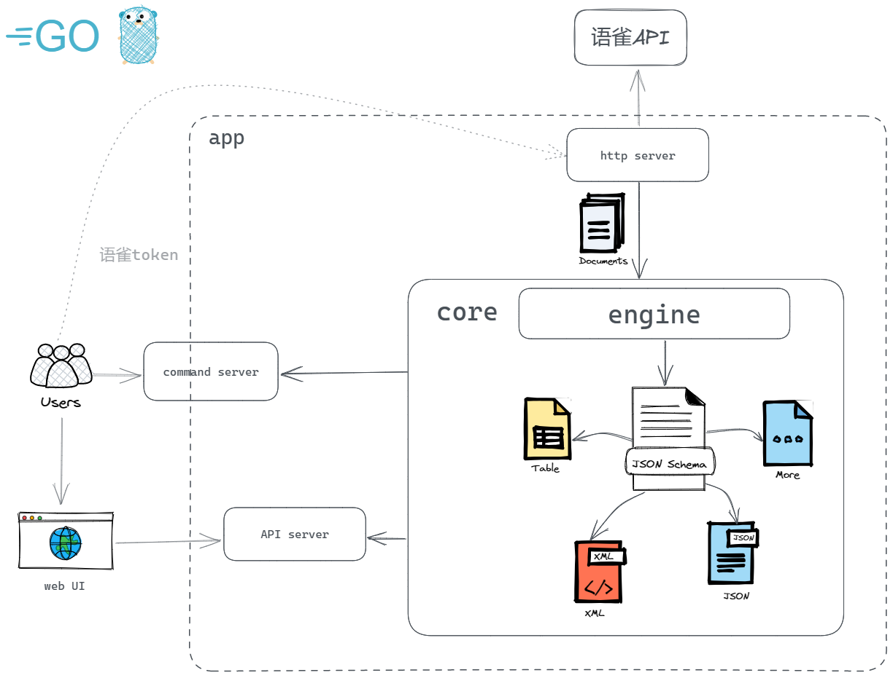
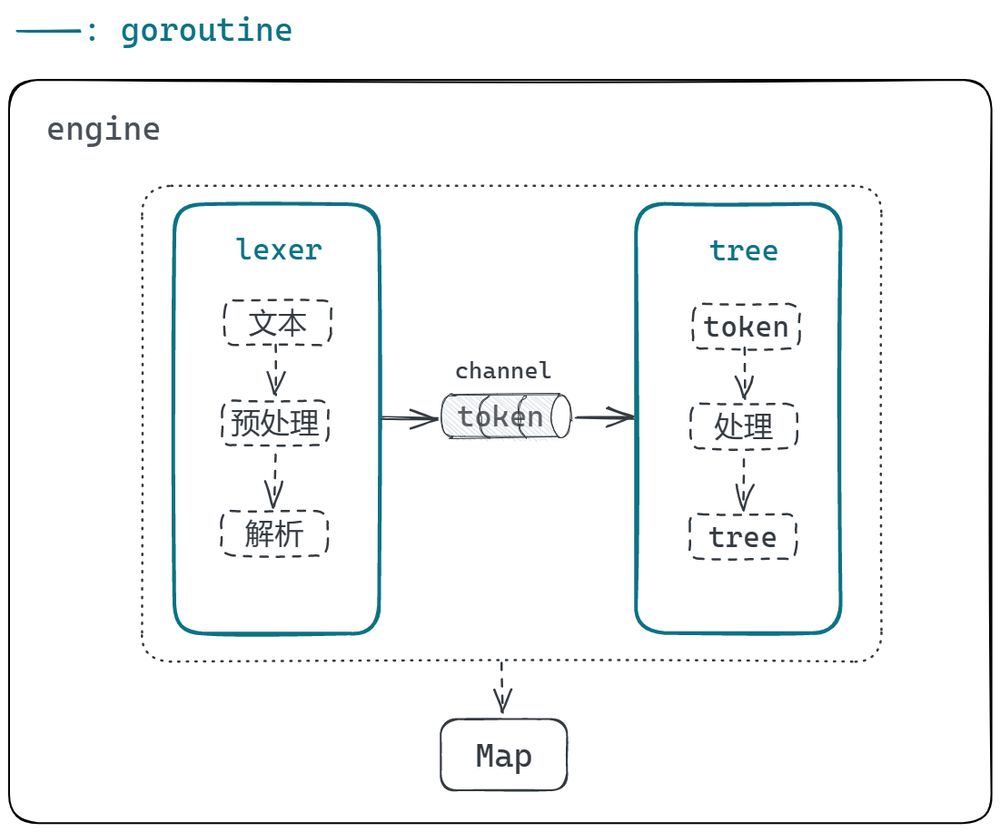

# 项目介绍

yuque-tool是一个用于增强语雀平台功能的拓展工具，通过yuque-tool可以快速创建和管理语雀文档，并且可以利用该工具拓展更多自定义功能。

yuque-tool提供了一个简单易用的命令行界面和一个友好的web页面，让您可以在语雀平台上执行各种操作。您可以使用该工具创建新的文档、导出文档、转换文档格式等功能。

## 功能特性

## 软件架构

`engine`部分的设计如下：

## 快速开始

### 依赖检查

### 构建

### 运行

## 使用指南

## 待办

## 关于作者

## 谁在用

